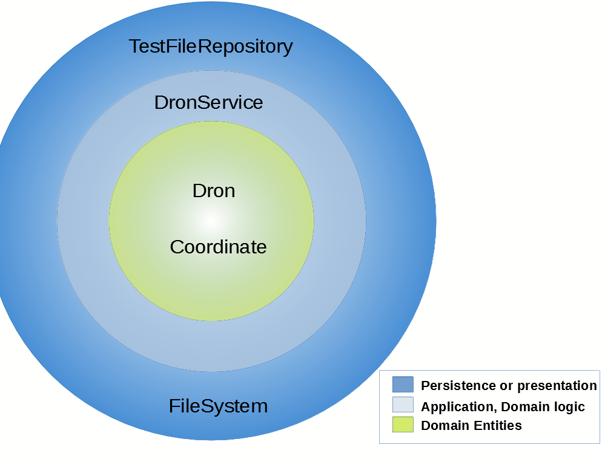
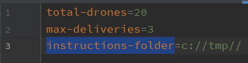
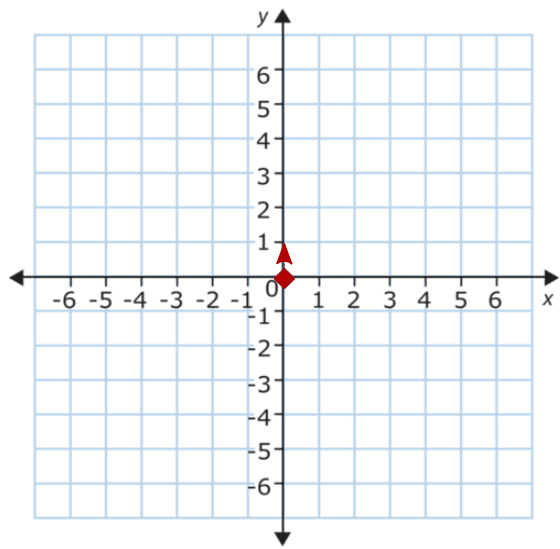
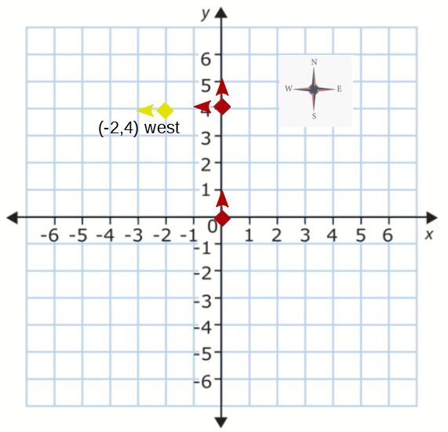

# Dron Restaurant App 
    
 Dron Restaurant keeps program a drone or drones to delivery your favourite food with specific instructions.
 
 It was developed to follow a Domain-Driven Design approach, based using techniques like TDD and best practices like SOLID principles.
 
  * How Run this App:
     - 
       You will need to first build with Maven; use the below command, please run it from the project folder which contains the pom.xml file.
       ```
       mvn package
       ```
       To run Delivery App from a command line in a Terminal window you can run the java -jar command. This jar is provided where the app was packaged as an executable jar file.
       ```
       Java -cp target/DroneRestaurant-1.0-jar-with-dependencies.jar com.s4n.restaurant.App
       ```       
  * Configure you App:
     - 

   You can configure a certain parameter list in your Dron Restaurant App. the configuration file is in the path: 
       
   ```
   src\main\resources\app.properties
   ```
   You can configure:
   


  when:
  
   * total - drones: number of  drones in your fleet.
   * max-deliveries: number of  max deliveries for dron.
   * instructions - folder: folder that contains all the instructions and reports files.

        
 * Examples:
    - 
1 You must put a txt file for each drone with the instructions for delivery. Please follow these recommendations:

  * Text file name will start with "in" prefix and then the number of the dron. For example for the dron number 1 the text file name will be in01.txt
  * Line instructions: each line in a file is an instruction.
    * A = ahead step.
    * D = 90 degrees right turn.
    * I = 90 degrees left turn.
    
2  Each dron stars in (0,0) North Coordinate:



3 For example for the line "AAAAIAA"  the dron will execute the following steps:



* AAAA = 4 steps ahead (0,4) North.
* I = 90 degrees left turn.(0,4) West.
* AA = 4 steps ahead (-2,4) West.
    
    
             
